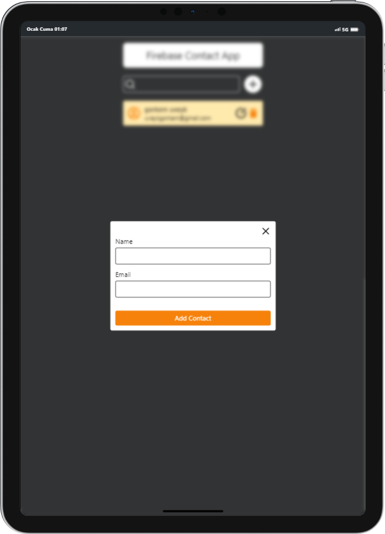

# Contact App

The contact app allows you to add your contacts to the database, delete them and update them if you wish.

## Preview

<div align="center">
  
  
  
</div>

## Installation

#### Clone

```
https://github.com/gorkemuveyk/contact-app.git
```

### Firebase

The contact app uses firebase. so create a project for firebase and specify your project information, for example in the api key **config/firebase.js** file.

```javascript
const firebaseConfig = {
  apiKey: import.meta.env.VITE_API_FIREBASE_API_KEY,
  authDomain: import.meta.env.VITE_API_FIREBASE_AUTH_DOMAIN,
  projectId: import.meta.env.VITE_API_FIREBASE_PROJECT_ID,
  storageBucket: import.meta.env.VITE_API_FIREBASE_STORAGE_BUCKET,
  messagingSenderId: import.meta.env.VITE_API_FIREBASE_MESSAGING_SENDER_ID,
  appId: import.meta.env.VITE_API_FIREBASE_APP_ID,
};
```

#### Package Installation

```
npm i
```

#### Start

```
npm run dev
```
